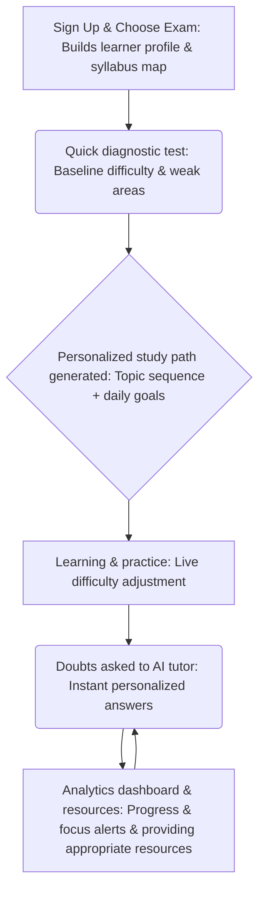

# EDUMITRA -> AI-Driven Adaptive Learning Ecosystem

## 📃A unified platform personalized in learning based on behavior, performance, pace & exam pattern — while offering dashboards for mentors.

**Link to Repository:** [click here](https://github.com/Abhilash5880/Edumitra)

This is a web app that creates personalized study plans, analyzes performance, leanring speeds, provides AI mentors, tracks progress for specific exams and study paths
### ✨ Features

* **Adaptive Study Engine:** ML-Based dynamic difficulty scaling
* **AI Mentor Bot:** Doubt-solving + micro-explanation 
* **Revision Intelligence:** Spaced repetition + weakness targeting.
* **Emotion & Focus Input:** Behaviour signal prompts (optional mood-check)
* **Mentor Dashboard:** AI insights on student readiness & risk flags.  

### ⚙️Technologies used :
| Layer | Tech. Stack |
|:---|:---:|
| Frontend | Next.js + Tailwind CSS |
| Backend | Node.js |
| Database | MongoDB | 
| AI/ML | Python, TensorFlow/PyTorch, LLM API |
| Adaptive Engine | Reinforcement Learning + Knowledge Graph |
| Authentication | Firbase/Auth0 |
| Hosting | Vercel |

## 💡 User Workflow: Mermaid Flowchart


### 🤝 Contributing

Contributions are welcome! If you have suggestions for improvements, new features, or bug fixes, please open an issue or submit a pull request.

### 📝 License
This project is open-source and available under the MIT license.

##

This is a [Next.js](https://nextjs.org) project bootstrapped with [`create-next-app`](https://nextjs.org/docs/app/api-reference/cli/create-next-app).

# Getting Started


First, run the development server:

```bash
npm run dev
# or
yarn dev
# or
pnpm dev
# or
bun dev
```

Open [http://localhost:3000](http://localhost:3000) with your browser to see the result.

You can start editing the page by modifying `app/page.tsx`. The page auto-updates as you edit the file.

This project uses [`next/font`](https://nextjs.org/docs/app/building-your-application/optimizing/fonts) to automatically optimize and load [Geist](https://vercel.com/font), a new font family for Vercel.

## Learn More

To learn more about Next.js, take a look at the following resources:

- [Next.js Documentation](https://nextjs.org/docs) - learn about Next.js features and API.
- [Learn Next.js](https://nextjs.org/learn) - an interactive Next.js tutorial.

You can check out [the Next.js GitHub repository](https://github.com/vercel/next.js) - your feedback and contributions are welcome!

## Deploy on Vercel

The easiest way to deploy your Next.js app is to use the [Vercel Platform](https://vercel.com/new?utm_medium=default-template&filter=next.js&utm_source=create-next-app&utm_campaign=create-next-app-readme) from the creators of Next.js.

Check out our [Next.js deployment documentation](https://nextjs.org/docs/app/building-your-application/deploying) for more details.
